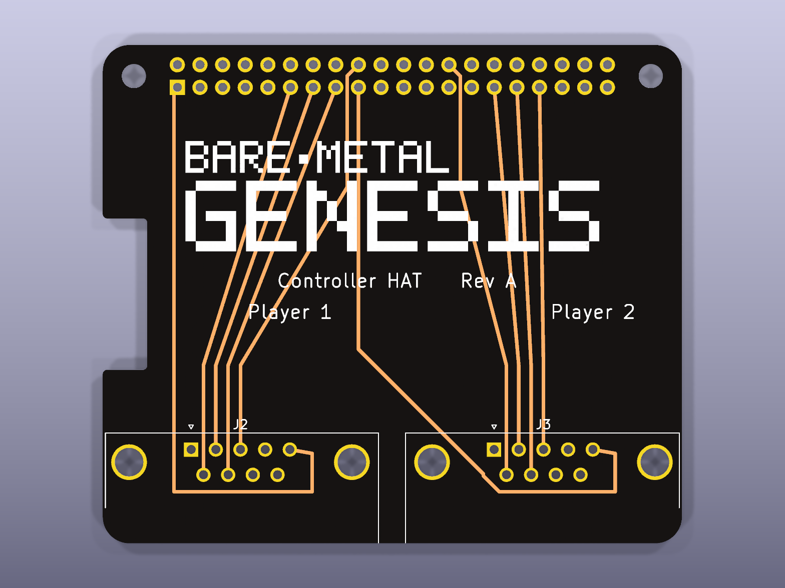
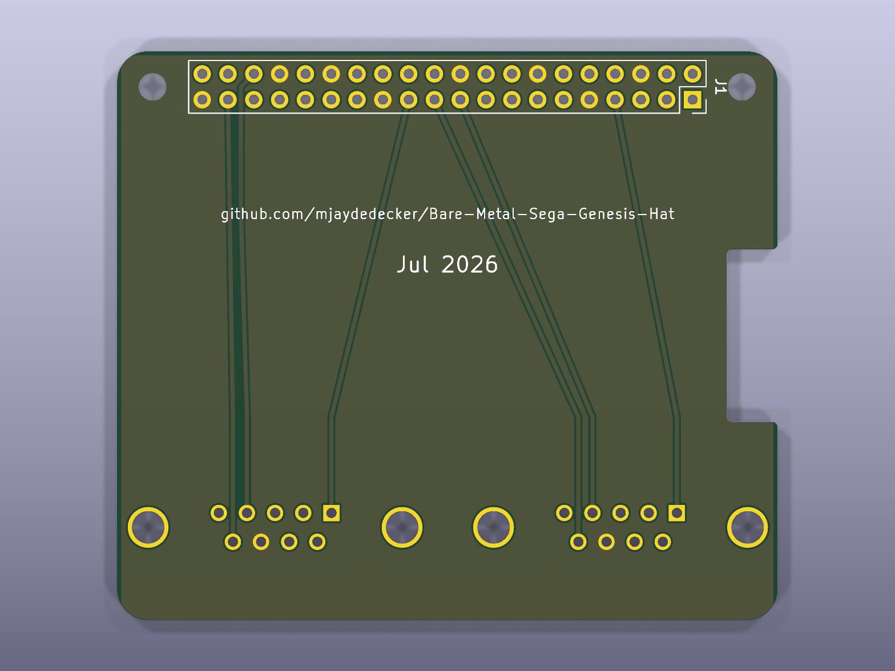

# Sega Genesis Controller HAT

A passive Raspberry Pi HAT exposing two DB9 (DE-9) ports for original Sega
Genesis / Mega Drive controllers, wired directly to the Pi's 40-pin GPIO
header.

<p align="center">
  
  
</p>

Licensed under [CERN-OHL-S v2](LICENSE) — see [License](#license) below.

This board has no firmware of its own. The pin assignment and electrical
contract it implements are owned by the firmware repo,
[Bare-Metal-Sega-Genesis](../Bare-Metal-Sega-Genesis), specifically
`src/input/sega_board.h` and
`docs/superpowers/specs/2026-06-25-gpio-sega-controllers-design.md`. If
those ever disagree with this repo, the firmware repo wins — update this
board to match it, not the other way around.

See `docs/superpowers/specs/2026-07-21-controller-hat-v1-design.md` for the
full design rationale (why no ID EEPROM, no protection circuitry, no
stacking header) and `docs/superpowers/plans/2026-07-21-controller-hat-v1.md`
for how it was built.

**2026-07-22:** the GPIO pin assignment was reassigned (see
`docs/reviews/2026-07-22-pinmap-reassignment.md`) to eliminate PCB routing
crossings, and a GND ground plane pour was added on `B.Cu`. A GitHub Actions
workflow (`.github/workflows/verify-pinmap.yml`) now checks on every push
that this board's schematic wiring matches the firmware repo's
`sega_board.h` exactly. The template's camera flex slot cutout (next to J3)
was also removed — this board has no camera and the slot was only crowding
J3's mounting plate; the recommended (not required) display flex cutout on
the left edge was left in place. J2 and J3 were then moved 3mm right / 6mm
left respectively so all 4 of their mounting holes sit fully on the board
(previously J2's left hole and J3's right hole were partially/fully off the
board edge) — each hole now has about 1mm of clearance to the edge, with
about 2mm of clearance between the two connector shells.

**Also 2026-07-22:** J2/J3 were switched from KiCad's `DSUB-9_Socket_Vertical`
footprint to `DSUB-9_Socket_Horizontal_..._EdgePinOffset7.70mm_Housed_MountingHolesOffset9.12mm`
(later corrected to the `Pins` — male — variant of the same footprint, see
below) — the vertical footprint has its DB9 opening facing straight up (a
cable plugs in from directly above the HAT), not out over the board edge.
The edge-mount/right-angle footprint hangs the connector's shell 9.12mm past
the board's bottom edge so a controller cable plugs in horizontally,
console-style. See "Known limitation: edge-mount connectors overlap the
corner mounting holes" below for a real trade-off this introduced.

**2026-07-22 (later the same day):** upgraded the project files from KiCad
9 to KiCad 10 format (`kicad-cli sch upgrade` / `pcb upgrade`) after the
toolchain was updated. ERC/DRC results are unaffected — see "Verifying the
board" below for current counts.

**2026-07-22 (still later):** replaced the "Genesis Controller HAT" title
silkscreen text with the "Bare-Metal Genesis" wordmark logo from
`design_files/Bare-metal Sega Genesis-handoff.zip`
(`project/kicad/bmg-logo-wordmark.svg`), placed on `F.Silkscreen` centered
between J1 and the two DB9 connectors (48mm wide, ~14mm tall). The source
SVG is entirely axis-aligned `<rect>` elements (pixel-art style), so it was
converted directly to 153 filled `gr_rect` silkscreen shapes at 1:1 fidelity
rather than traced/vectorized. "Rev A" was moved down slightly to stay clear
of the logo, and "Controller HAT" was added back alongside it on the same
line. No DRC/ERC change from this (silkscreen doesn't need clearance from
the copper traces it sits over).

**2026-07-22 (yet later):** added this repo's URL and a build date to the
board's *back* silkscreen (`B.Silkscreen`) — the front was already full
with the logo, title, and port labels. Back-layer text needs its "mirrored"
flag set so it reads correctly once the board is physically flipped over;
easy to miss when adding text via `pcbnew` scripting (the GUI does this
automatically, scripting does not).

**2026-07-22 (last, and most important):** J2/J3 were corrected from
**female** DB9 sockets to **male** DB9 pins. This was a genuine design
mistake, not a spec change: a real Sega Genesis controller's cable ends in
a *female* DB9 connector, so the HAT needs *male* ports to receive it —
the opposite of what had been built, through every earlier revision in
this log. It was caught by physically checking two real controllers
(original and third-party), not by any verification step in this project;
the connector gender was never checked against a datasheet, photo, or real
hardware before this. See
`docs/reviews/2026-07-22-pinmap-reassignment.md` for the full correction.

The fix wasn't a simple footprint swap: a male DB9's physical pin order is
the mirror image of a female one's, left-to-right. The GPIO pin
reassignment (done earlier the same day to fix routing crossings) had been
carefully matched to the *female* connector's pin order, so it no longer
avoided crossings once the connector was corrected, and had to be
re-derived to match the male connector's actual pin order — see the
firmware repo's updated `sega_board.h` and this repo's updated
`docs/reviews/2026-07-22-pinmap-reassignment.md`. GPIO12/23 moved to
spare; GPIO9/11 moved out of spare.

## Files

- `genesis-controller-hat.kicad_pro` / `.kicad_sch` / `.kicad_pcb` — the
  KiCad 10 project.
- `design_files/` — source design assets (currently the Bare-Metal Genesis
  logo handoff package); not needed to open or modify the board, kept for
  provenance.
- `scripts/` — the editing scripts used to build the schematic and PCB from
  KiCad's official `RaspberryPi-HAT` template. Not needed to open or modify
  the board in the KiCad GUI; kept for provenance/audit.

## Known limitation: PCB net table includes stale entries

The PCB's net table still lists nets for GPIO pins and the ID EEPROM/+5V
circuit that were deleted from the schematic (I2C, UART, I2S, the four
spare GPIOs, `ID_SDA`/`ID_SCL`, `+5V`). No footprint or track references
them, so they're inert, but a `kicad-cli pcb drc --schematic-parity` run
will flag the mismatch. There is no headless "update PCB from schematic"
command in this KiCad install — if you need full parity (e.g. before
opening this in the GUI to do further layout work), open the project in
the KiCad GUI once and run Tools → Update PCB from Schematic.

## Known limitation: only 2 of the 4 official corner mounting holes remain

J2/J3's edge-mount footprint has a 30.85mm-wide plastic mounting base (the
flat bracket that carries the connector's own two screws). The board's
official corner mounting holes are only 58mm apart, and the math didn't
work out: positioning each connector far enough from its nearest corner
hole to fully clear it pushed the two connectors' bases into each other in
the middle. Clearing J2/J3 from each other (the more important constraint,
since overlapping *each other* would mean the parts can't be populated at
all) was prioritized, which left each connector's base overlapping its
nearest corner hole — J2 over the bottom-left hole (`MH3`), J3 over the
bottom-right hole (`MH4`). Both bottom corners were affected, not just one.

Since those two mounting screws could never actually be installed (the DSUB
bracket's plastic physically occupies the space), **`MH3` and `MH4` were
removed** rather than left in as dead weight — `courtyards_overlap` is now
zero. This board mounts on only the 2 remaining corner holes (`MH1`/`MH2`,
both at the top, next to the GPIO header) plus the GPIO header's own
friction fit; it no longer meets the official HAT spec's 4-corner-hole
requirement (this board was already not pursuing full HAT certification —
see the design spec's "Scope decisions"). If 4-point mounting matters for
your use case, the alternatives are the same as before: a DSUB with a
narrower bracket, or reverting to the smaller vertical-mount footprint
(mating face up, not edge-accessible).

## DRC and ERC status

**2026-07-23:** the 4 remaining `tracks_crossing` errors on `+3V3`
(described below as needing "a via or manual interactive routing") were
fixed. They turned out to be real same-layer shorts, not just a DRC
nitpick — and `kicad-cli`'s DRC was only surfacing 4 of the actual 8
crossings on that net (confirmed by an exhaustive geometric check of every
same-layer track pair). Both `+3V3` legs (J1→J2 pin 5, J1→J3 pin 5) were
rerouted around the *outside* of the connector's own pin field instead of
weaving between individual pins, entering pin 5 from clear space beyond
the connector rather than crossing the other GPIO nets. `+3V3`'s segment
count dropped from 87 to 13 in the process. `kicad-cli pcb drc
--severity-all` now reports **0 errors / 0 warnings**.

`kicad-cli pcb drc --severity-all` on `genesis-controller-hat.kicad_pcb`
reports 0 errors / 0 warnings — down from 30 errors / 6 warnings before
the first 2026-07-22 pin reassignment. `shorting_items`,
`solder_mask_bridge`, `hole_clearance`, `copper_edge_clearance`,
`courtyards_overlap`, `silk_edge_clearance`, `lib_footprint_mismatch`, and
`tracks_crossing` are all now **zero**. Getting there took several passes
across two separate reassignments (first to fix routing crossings, second
to correct the connector gender — see the log above), then the `+3V3`
reroute above:

1. The first pin reassignment (see
   `docs/reviews/2026-07-22-pinmap-reassignment.md`) eliminated same-layer
   crossings between J2/J3's own routing for the *female* connector, but
   left `shorting_items`/`solder_mask_bridge` where the resulting breakout
   tracks skimmed past unrelated J1 pads.
2. Each affected track was rerouted to jog around J1's row-A pins instead
   of skimming past them — J1's two pin rows are only 2.54mm apart, so a
   track targeting a row-B pin has to actively route around the row-A pin
   directly in front of it, not just aim at the target.
3. The connector gender correction (female → male) mirrored each
   connector's physical pin order, which broke the first reassignment's
   careful non-crossing correspondence. A second GPIO reassignment (see
   the same doc) re-derived a new pin order matched to the male
   connector's actual layout, and the row-A-jog technique was reapplied to
   the (different) 3 nets that now need it (`GPIO24`, `GPIO7/SPI0.CE1`,
   `GPIO16`).

Remaining violations:

- `unconnected_items` (1, info-level) — `+3V3` is two disconnected copper
  islands on this board (J1 pin 1 → J2 pin 5, and J1 pin 17 → J3 pin 5,
  not tied together locally). Not a defect: both islands get +3.3V from
  the Pi header's own internally-tied pins 1 and 17, so local copper
  continuity isn't needed. Pre-existing in KiCad's own template since
  before this HAT project touched it; cannot be "fixed" without adding a
  pointless jumper trace.

ERC is **0 errors / 0 warnings**. The schematic's cache-drift warning
(`lib_symbol_mismatch` on J2/J3's `DE9_Socket_MountingHoles` symbol — since
superseded by the gender correction's switch to `DE9_Pins_MountingHoles`)
and the PCB's equivalent (`lib_footprint_mismatch` on J1's header
footprint), both introduced by the KiCad 9→10 upgrade revising those
library definitions, were fixed:

- **Schematic:** `scripts/kicad_sexpr.py` gained a
  `refresh_lib_symbol_cache(tree, lib_id)` helper that replaces a
  schematic's stale cached symbol definition with the current one from the
  system library.
- **PCB:** J1 was removed and replaced with a fresh instance of the same
  footprint (`Connector_PinSocket_2.54mm:PinSocket_2x20_P2.54mm_Vertical`)
  loaded straight from the system library, at the same position/rotation/
  flip state, with every pad's net reassigned by pad number to match. The
  only real difference between old and new was pad shape (`OVAL` vs
  `CIRCLE` — cosmetic for a 1.7×1.7mm round pad, since equal width/height
  makes the two shapes identical) — confirmed by comparing every pad's
  position, size, and drill before swapping. Fixing this the same way
  dropped `unconnected_items` from 2 to 1 as a side effect: the swap
  dropped several stale net-table entries for GPIO pins with no real
  circuit (I2C, UART, I2S, EEPROM ID — already inert, unreferenced by any
  track), which happened to include the "J1 pins 2/4 unused +5V" pair.

`silk_edge_clearance` is also fixed: J2/J3's outline-box silkscreen (drawn
slightly larger than the copper, matching the connector's real body) had
two sides running right along the board edge — one side sat fractionally
*past* the edge, and both connectors' outer sides dipped down into the
rounded bottom corners, where the board narrows and the line ends up
outside the board entirely. Nudged each offending line ~0.3mm inward and
trimmed its length to stop before the corner begins — a purely cosmetic
change to the silkscreen artwork on these footprint instances, no change
to pads, copper, or the connector's real footprint envelope. (Reapplied
once already, after the connector gender correction replaced J2/J3 with
fresh footprint instances that needed the same trim redone.)

**Before fabricating this board, resolve the corner-hole trade-off
documented earlier**; DRC is otherwise fully clean (0/0).

## Verifying the board

```bash
kicad-cli sch erc --severity-all genesis-controller-hat.kicad_sch
kicad-cli pcb drc --severity-all genesis-controller-hat.kicad_pcb
python3 scripts/check_pinmap.py ../Bare-Metal-Sega-Genesis/src/input/sega_board.h
```

ERC should report 0 errors / 0 warnings. DRC should also report 0 errors
/ 0 warnings (1 info-level `unconnected_items` note — see "DRC and ERC
status" above, it isn't a bug). `check_pinmap.py` (also run in CI on
every push) confirms the schematic's actual wiring matches the firmware
repo's `sega_board.h`.

## License

Licensed under the [CERN Open Hardware Licence Version 2 - Strongly
Reciprocal (CERN-OHL-S v2)](LICENSE). Anyone may use, study, modify, and
distribute this design, including commercially — derivatives that are
distributed (as hardware or as design files) must be released under the
same license, with source design files made available. See the
[CERN-OHL-S FAQ](https://ohwr.org/project/cernohl/wikis/faq) for a plain-
language summary; the `LICENSE` file is the authoritative text.
